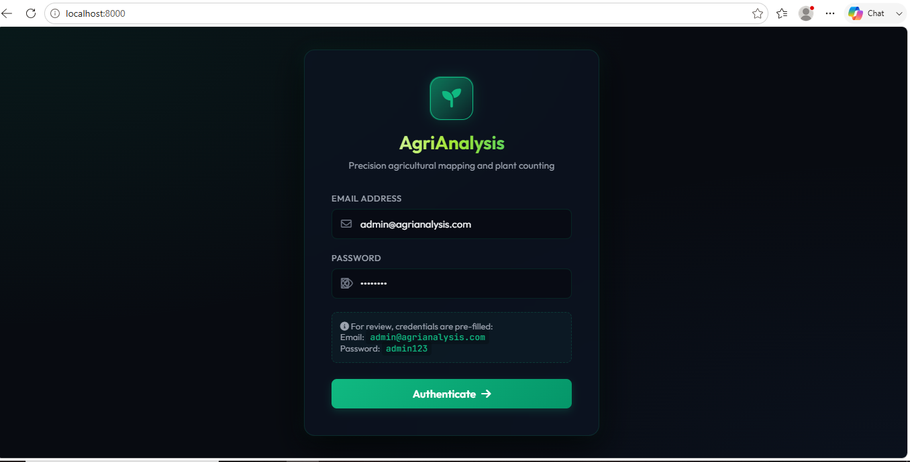

# AgriAnalysis-Web-App 🌱
Drone-based agricultural mapping with plant counting + vegetation health analysis.

**Tech**: Python, Flask, OpenCV, ExGI, Connected Components 

**Features**
- Upload orthophoto `.tif` → get plant count
- ExGI vegetation health map output
- Browser-based, no install needed

**How to run locally**
```bash
git clone https://github.com/Runako123/AgriAnalysis-Web-App
cd AgriAnalysis-Web-App
pip install -r requirements.txt
python APP.py

# AgriAnalysis-Web-App 🌱

# AgriAnalysis-Web-App 🌱

**Precision agricultural mapping and plant counting** with Flask + OpenCV.

### **UI Preview**

*Login page with demo credentials for reviewers*